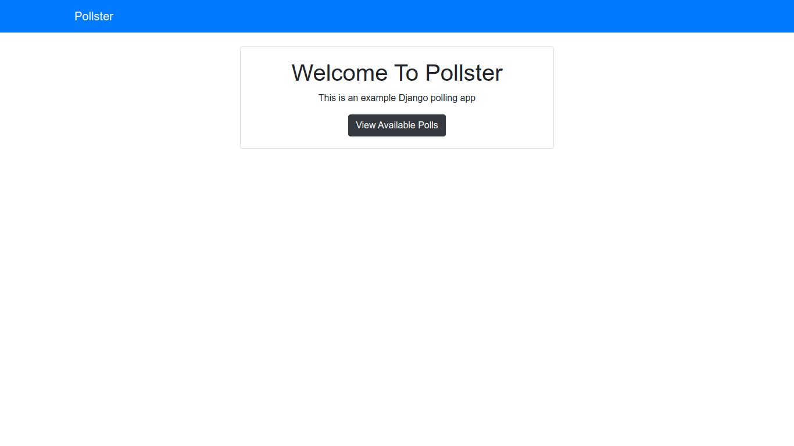
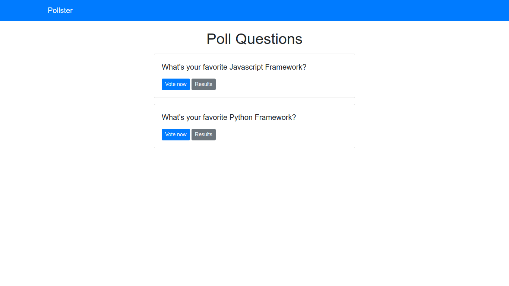
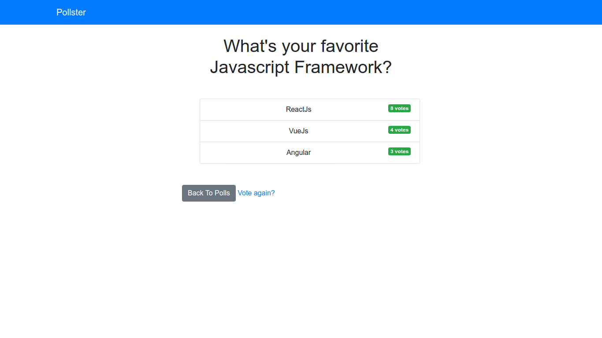

# TODO LIST APP

"Pollster App" project. This application was made for learning purposes. Essentially, it's a getting started with Django Framework. See ["Built With"](#built-with) section for more details.

## GETTING STARTED 🚀

These instructions will get you a copy of the project up and running on your local machine for development purpose.

### PREREQUISITES 📋

- [Pipenv](https://github.com/pypa/pipenv/) Python Development Workflow for Humans.
- [Python](https://www.mongodb.com/)  a programming language that lets you work quickly and integrate systems more effectively. *I'm currently using Python 3.7.7*

### INSTALLING 🔧

Clone this repository by pasting this command on your terminal/prompt:

```
git clone https://github.com/FranSantiago/pollster_project.git
```

Change to the new repository:

```
cd pollster_project
```

If pipenv is installed, then, you must activate a environment:

```
pipenv shell
```

Install packages dependencies like that:

```
pipenv install --dev
```

Start the server by typing:

```
cd pollster
python manage.py runserver
```

Now, open your browser and type:

```
localhost:8000
```

You will "get" the home page as follows (language: pt-br):



## SCREENSHOTS




## BUILT WITH

- Django Framework
- Bootstrap
- Html
- CSS

## AUTHOR

- **Françoar Santiago** - _Full Stack developer_ - [@fransantiago](https://github.com/fransantiago) on GitHub

## LICENSE 📄

This project is licensed under the MIT License - see the [LICENSE.md](LICENSE.md) file for details
